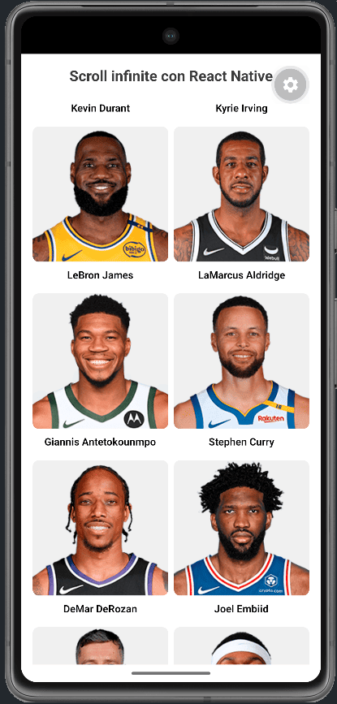

# React Native Infinite Scroll

App en Expo que consume la API de jugadores NBA y muestra sus fotos en un grid de dos columnas.
Al hacer scroll se cargan más jugadores de forma progresiva, simulando paginación infinita.
Construida con React Native, TypeScript y Axios.

## Demo

<p align="center">
  
</p>

## Cómo correr el proyecto

```bash
npm install
npx expo start
```

Luego escanea el QR con Expo Go o presiona `i` (iOS) / `a` (Android) en la terminal.
